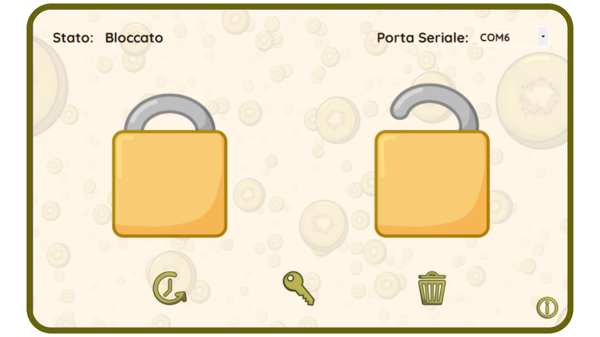

# Kiwi Lock

**Kiwi Lock** è il software prorietario che gestisce il Kiwi PadLock. È stato creato per un progetto di gruppo.

## User Experience
All’apertura iniziale, l’utente deve scegliere il nome del lucchetto e inserire la password.
Successivamente alla creazione del lucchetto, a ogni apertura dell’app verrà richiesta l’autenticazione.
L’interfaccia presenta due pulsanti principali e tre secondari. I due principali possono essere usati dall’utente per bloccare e sbloccare il lucchetto.
Gli altri servono rispettivamente per generare il log delle azioni, per modificare la password e per eliminare il lucchetto registrato.
É importante notare che il lucchetto deve essere connesso al computer per eseguire operazioni sul programma. Molto importante è anche disattivare il Bluetooth prima di avviare il programma!

## Funzionamento
Il Software deve il suo funzionamento alla libreria di C# System.IO.Ports, la quale permette di comunicare tramite porta seriale con apparati esterni, nel nostro caso il Kiwi PadLock, gestito dall'Arduino.
Il programma, ogni volta che rileverà che il Kiwi PadLock è connesso,  comunicherà con esso attraverso codici mono carattere che gli indicheranno lo stato che dovrà assumere.
Inoltre il programma gestirà le richieste inviate dal Kiwi PadLock, anche declinandole nel caso in cui il programma sia impegnato a svolgere altre attività.
La grafica è stata sviluppata utilizzando i Windows Forms integrati all'interno di .NET Framework (4.8), estensione del linguaggio di programmazione C# e runtime che permette di eseguire applicazioni visuali, sviluppata da Microsoft e disponibile all'interno di Visual Studio.

## Codici per la comunicazione

-  “s” -> (Ricevuto dal programma) Il Kiwi PadLock richiede l’inserimento della password
-  “C” -> (Ricevuto dal programma) Il Kiwi PadLock conferma al programma che tutto sia funzionante
-  “H” -> Richiesta della conferma che il dispositivo collegato sia il Kiwi PadLock
-  “0” -> Chiusura del Kiwi PadLock
-  “1” -> Apertura del Kiwi PadLock
-  “2” -> Invia il Kiwi PadLock in stato di attesa e disattiva il sensore
-  “4” -> Esce dallo stato di attesa e attivazione del sensore
